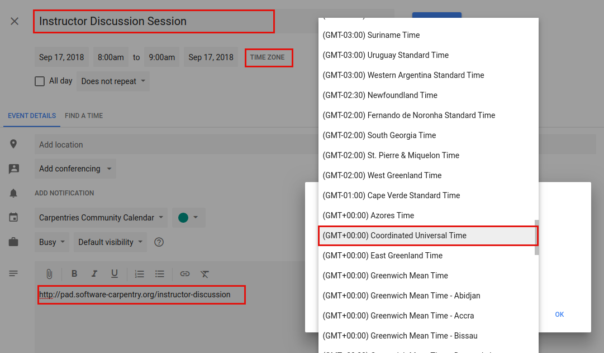
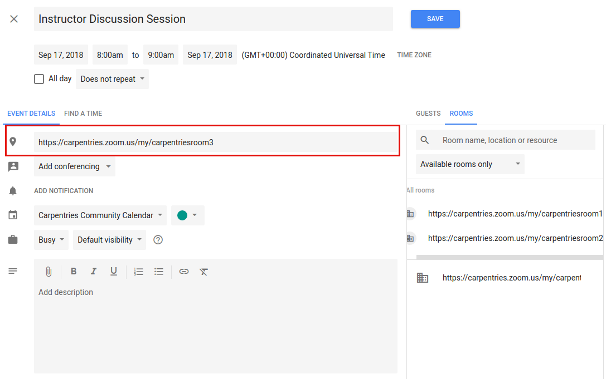

## Zoom Rooms

The Carpentries offers three Zoom rooms for public community events.  Zoom rooms are available for events such as discussion sessions, teaching demos, and committee meetings.

#### General Room Usage and Links

Rooms are generally used as follows.  However, any room can be used for other purposes if it is available.
Links below will open Zoom and enter the respective room.

* [**Click to enter Room 1:**](https://carpentries.zoom.us/my/carpentriesroom1) Instructor Training
* [**Click to enter Room 2:**](https://carpentries.zoom.us/my/carpentriesroom2) Community events (teaching demos, discussion sessions, committee meetings, etc.)
* [**Click to enter Room 3:**](https://carpentries.zoom.us/my/carpentriesroom3) Other events as needed 

Each room can have a host who will have privileges to mute people, create breakout rooms, etc.  Please contact team@carpentries.org if you would like host privileges for an event.

### Zoom Manual 
The Carpentries online community events are held on [Zoom][zoom-home].  The Carpentries staff will set up host access to our Zoom rooms for people leading community events. No login is needed for event guests; however a browser plug in may be required.

If you are leading an event, you will be given host access to the event. This will give you extra privileges including the ability to mute participants and assign participants into breakout rooms. Only one person can be logged in as host at a time, and another person logging in as host will kick the original offline. However, the host can transfer host privileges to other participants if you need to trade host status with co-facilitators during the event.

All Carpentries online events are set up such that participants can enter the room without the host being present. If you ever get an error message saying you can’t join the room because you’re not the host, please [contact The Carpentries staff](mailto:team@carpentries.org) immediately.

##### Host Abilities:  
- “Mute” is in the lower left. To mute other participants, the host can go to “Manage Participants”, hover over a participant’s name, and click “mute”.  The host can also mute all participants at once.
- When the room host clicks “End Meeting” a dialogue box appears with three options: “Cancel”, “Leave Meeting” and “End Meeting for All”. Be careful not to end the meeting if you are leaving the room while the event is still active.
- Only the host has the ability to create “Breakout rooms”. The button for this is on the lower left. Breakout rooms can be assigned automatically. By default, participants will be assigned to the same groups each time breakout rooms are used. You can change participants assignments manually if desired.  
- The host can move between breakout rooms and can send messages to all rooms simultaneously.  

##### General Tips:  
- “Gallery view” in the upper right toggles the display to show more participants videos.  
- “Share screen” is at the bottom middle of the screen. To end “share screen” you click the red button that will appear at the top middle of the screen when you are in screen sharing mode.  
- When you screen share, you have the option to share individual apps or your entire desktop. The default is the full desktop.  
- The Zoom chat is not stable (it is not saved across sessions or after going into breakout rooms). We highly recommend using the Etherpad or Google Doc chat instead. 
- If a trainee is using Linux and gets the error message "Can not start share, wayland has not been supported yet, 
please use x11 instead", have them log out of Zoom and log back in. On the login screen there is a gear with a dropdown menu there choose the option with x11.

#### Viewing Zoom Room Availability

Zoom room calendar views are public - anyone can view whether a room is available.  Only Carpentries staff members can actually book a room. If a room is available, please contact a staff member or team@carpentries.org if you would like to make a room reservation.

Room availability can be viewed below. 
* Red: Room 1
* Orange: Room 2
* Green: Room 3

Placeholder: Embedded Zoom Room Calendar

### Adding an Event to the Community Calendar

Note while anyone can view room availability, only Carpentries staff members may book events or reserve a Zoom room.

To add an event to the [Community Calendar](https://calendar.google.com/calendar/embed?src=oseuuoht0tvjbokgg3noh8c47g%40group.calendar.google.com&ctz=America%2FNew_York) and book a Zoom Room for it:

* Give the event a meaningful title ("Demos" is not as good as "Instructor Training Teaching Demos")
* List the time zone in UTC - not your local time zone.  Events set in local time zones do not always correctly adjust for daylight savings time.
* Add a description, including a link to the relevant Etherpad or other document.

* Select a room.

    

    * Each available room will be listed. If you are scheduling a recurring event, any future conflict will prevent a given room from being listed as available.
    * Multiple rooms can be selected for a single event.
    * Click on a room to select it.  The Zoom link will now appear in the location.

    

    * If you select a room and immediately remove it, it may not appear as available again until you close out the edit event screen and enter it again.
    * Save the event.
    * The event will now show up on The Carpentries Community Calendar and the Zoom Rooms Calendar.

Be sure to complete the above steps in order (i.e., do not select a room before setting the exact date and time).

### Creating a Zoom Room Option on Google Calendars

This will only need to be done once for each new room.  This is already done for Zoom Rooms 1, 2, and 3.  If additional Zoom rooms are added, they will need to be set up here.  This must be done by someone with admin access to The Carpentries' Google console.  

Go to the [Google admin console](https://admin.google.com/AdminHome?hl=en).  Click on "Buildings and Resources" and then click "Edit Resources" under "Resource Management."

You will see all existing buildings and rooms listed. This feature is meant for physical buildings; we are using it for virtual videoconferencing rooms. One "building" is set up, called "Zoom Rooms" that contains three resources -- Zoom Room 1, Zoom Room 2, and Zoom Room 3.  

To add a new "room" in this "building" - click on the yellow plus sign next to "Resources."  Fill out the following information:

* Category: (no category set)
* Type: *leave blank*
* Building: Undefined
* Floor: Undefined
* Floor section: *leave blank*
* Resource name: Link to the Zoom Room
* Capacity: 100 (standard for all Zoom rooms)
* Features: *leave blank*
* User visible description: Note what this room is used for.

When done, click "ADD RESOURCE" and this new room should be on your list of rooms.  This room will now be available for scheduling events as described above.

[zoom-home]: https://www.zoom.us/

