### Event registration using Eventbrite

Host sites can opt to use their own systems for registering learners at their workshops, or we can set up a registration page using [Eventbrite](https://www.eventbrite.com).

#### Logging in

The Workshop Administration Team will have log in credentials from the Carpentries. They will give hosts of individual events access to log in to that event only.

Contact team@carpentries.org with questions about logging in.

#### Creating a new event

Click on "Manage Events" under "CARPENTRIES"

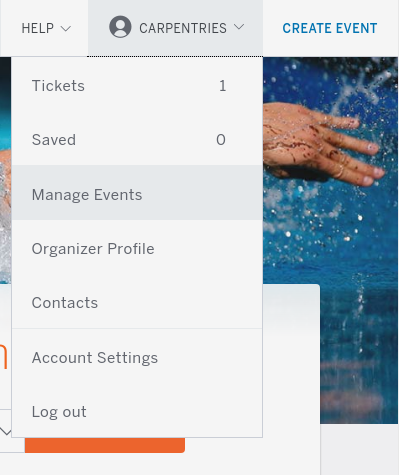

You'll see Live, Draft, and Past workshops. To create a new event, you can use one of the existing drafts as a template. Click on "Drafts."

Select "Manage" under the template for the appropriate Carpentries lesson program.

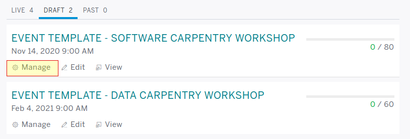

Copy this event, giving it a meaningful name.

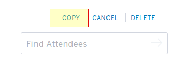
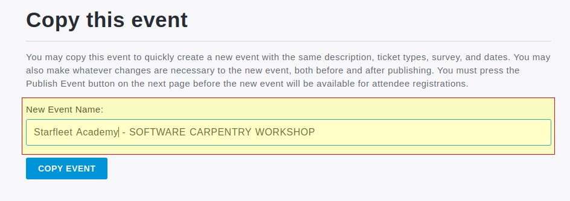

You can now set up the new event page.  

Fill in the address for the event location. If you don’t see boxes for address, city, state, country, etc., click on “Enter Address” to display them.

Fill the start/end date/time information. Note that Eventbrite does not let you have multiple day events, so for an event that goes 9 am to 5 pm both January 1 and 2 you have to make it look like it starts at 9 am on January 1 and goes until 5 pm on January 2.  Otherwise Eventbrite treats it as two events. Be sure to select the correct time zone.

The overall template includes a templated description of the event. Update this with the start and end times, the GitHub link, and link to the pre-workshop survey. You can also add in any other information specific to that event.

#### Create tickets

Eventbrite allows for both free and paid tickets. These settings can not be changed once the event has been published, so be sure to verify this in advance. You can have a mix of free and paid tickets.

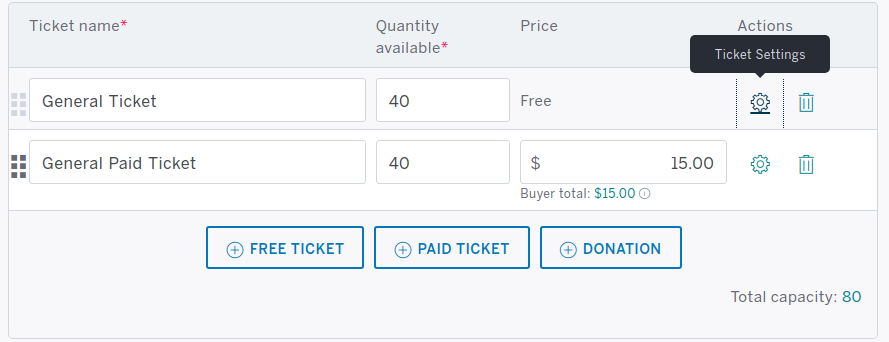

If the workshop is entirely free, delete the paid ticket option by clicking on the trash can icon (or delete the free option if all tickets are paid).

Click on the gear icon to edit settings for that ticket type.

For free tickets, you can customize the ticket type name. Edit the number of tickets available and dates when ticket sales start and end.

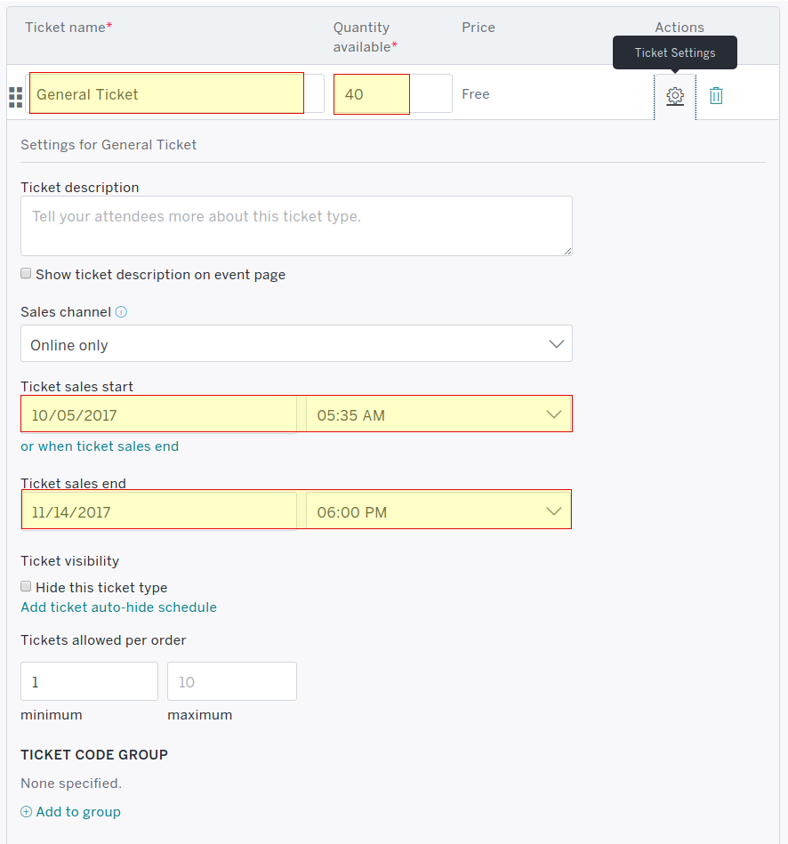

For paid tickets, you can customize the ticket type name. Edit the number of tickets available and dates when ticket sales start and end. Edit the cost per ticket. Select "Absorb fees."  You must also set a refund policy - be sure to confirm this with the host site.

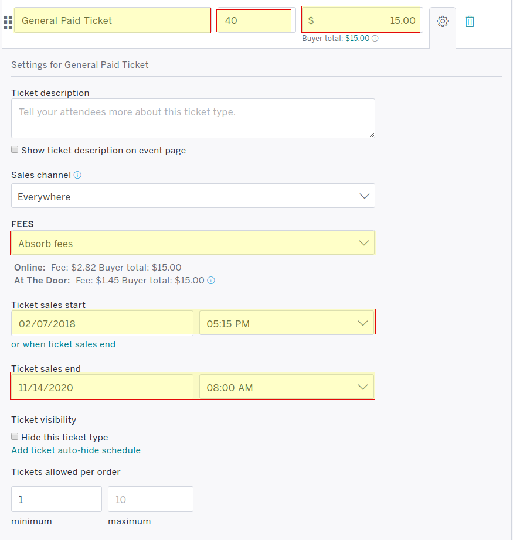

At this point the event is almost ready to be published.  It's a good idea to let the host contact look over the page before it goes live. You can do this by initially publishing it as password protected.

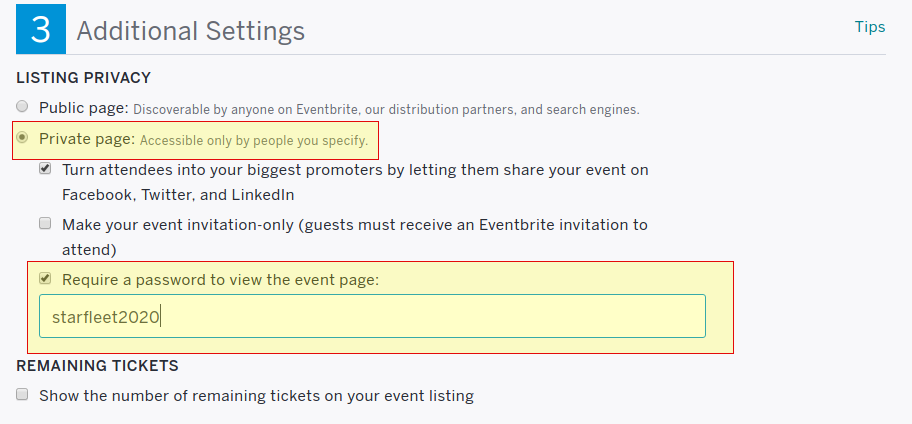

Make it a private event, requiring a password.

You can now either save this event if you need to work on it more, or publish it (make it live).

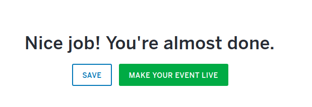

This will take you to your event dashboard where you can monitor ticket sales. Click "view" on the top right corner to see what this page will look like publicly. 

Share this link with the host site along with the password you created so they can look over the page and confirm that it looks good, or suggest changes if needed. Once it looks good, select "edit" from the dashboard and remove the password so the page can be shared publicly.

#### Giving hosts access to view registration

Often a workshop host will want to check in to see who's registered, manage the waitlist, email registrants, etc. You can set this up through Account Settings.

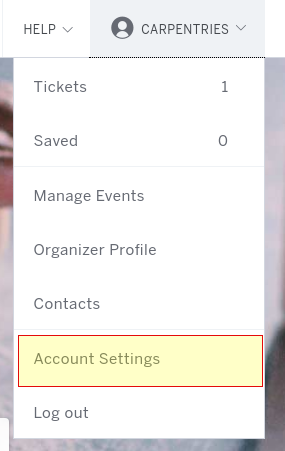

From here, select "Multi user access" from the options on the left.

You'll see a list of all email addresses that have access to at least one of our events. If you're giving an existing user access to a new event, select "edit" next to their email address.  Otherwise click the "Add Email Address" button at the bottom of the page.

Enter the person's email address and give them access to their event only.

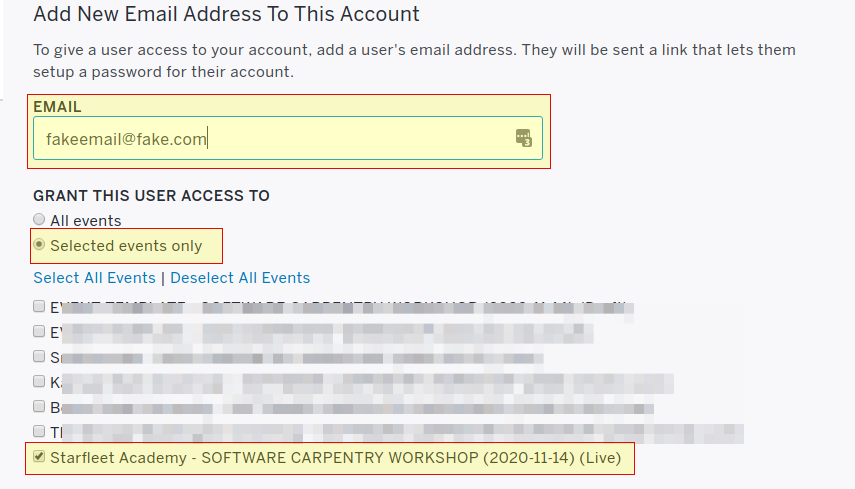

Give the user access to at most the following actions only:
* Edit event details not including payment options
    * Edit ticket types
    * Customize the registration page
* View order and attendee reports (read only)
    * Manage orders and attendees
    * Access to aggregate financial data
* Send invites, manage contacts, and email attendees
* Check in Attendees

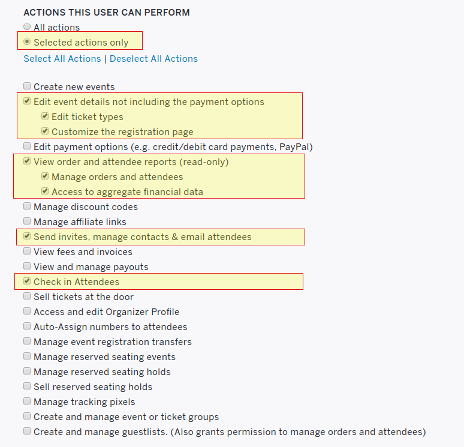

The user should get notifications for:
* Order confirmations
* Contact the organizer
* Refund requests

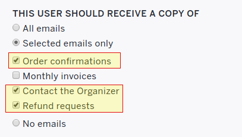
