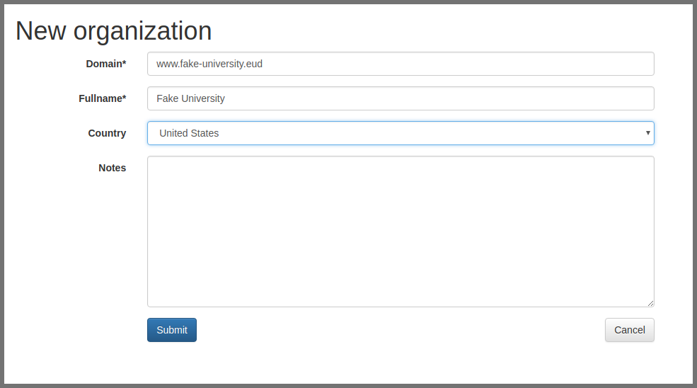
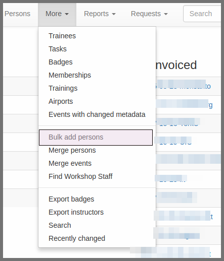
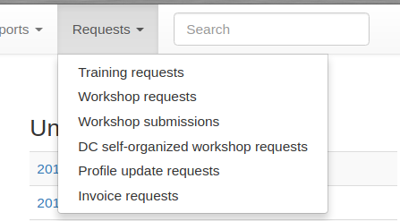
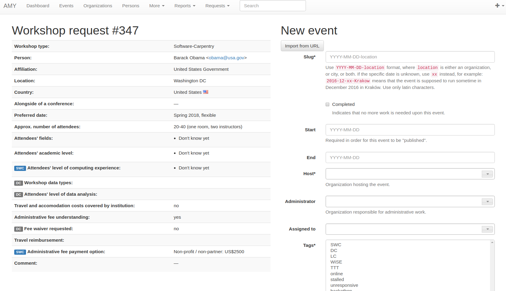

## AMY: the Carpentries' internal database

### Logging in

* Log in to AMY [here](https://amy.software-carpentry.org/workshops/admin-dashboard/).  Contact Carpentries staff if you need login credentials.

### AMY dashboard

All the menus and a search bar are displayed across the top. The main page has three column view showing published workshops, uninvoiced workshops, and unpublished workshops.

This view can be filtered to show workshops assigned to the logged in administrator, unassigned workshops, or all workshops.

* *Published workshops* have a complete start and end date, a valid url, and a complete location
* *Uninvoiced workshops* are those the invoice status is marked "Invoice not requested"
* *Unpublished workshops* are all workshops that do not meet the criteria to be published

Published workshops will show up on the Software Carpentry or Data Carpentry website, depending on how they are tagged.

From here you can also add new persons, events, organizations, or airports to the database.

### Adding a new organization

If the site name is not already in AMY, add a new one by selecting "New Organization." Do not enter `http://` or any slashes in the domain name.

### Adding a new person

If a person's record does not exist in the database, it can be added individually or as part of a bulk upload.

#### Adding an individual record

Select "New person" and enter in as much information as possible.  At minimum a personal name is required.  If the airport is not listed, it will need to be [added in](#adding-a-new-airport).

#### Adding bulk records

If the person has a role associated with a specific event, `Person` records can also be added in bulk using the `Bulk add persons` menu option in the regular `+` menu or the `More` menu.

Use the blank template to generate a well formed csv noting each person's personal name, family name, email address, role, and associated event.

The role must exactly match the instructions. The event slug must exactly match the slug for the event recorded in AMY.

This will take you to a screen where you can verify each record, correct any errors, and submit them for bulk upload.

### Adding a new airport

Airports are used as approximate geographic identifiers for our instructors.  Each airport is identified by its three digit IATA code which can be looked up using the link in AMY.

Enter in the airport's IATA code, full name, country, and latitude and longitude.

### Adding a new event

New events can be created one of several ways:
* By manually entering all information on the [new event page](#)
* By importing from URL on the [new event page](#)
* By accepting a [workshop request](#)

#### Creating a new event manually

* Create the workshop slug.  This must be in the form `YYYY-MM-DD-sitename` (for example, `2018-01-01-hawkins`.  The same slug should be used for the workshop's github page and any other place the workshop is identified.  If the exact date is not known, `XX` can replace the month and/or day (for example, `2018-01-xx-starfleet`).  

* If known, enter in the workshop dates.  

* Select the host site name from the drop down menu. If the host site does not appear on the list, [create a new organization](#).

* Select the administrator from the drop down menu.  This will almost always be `Software Carpentry`, `Data Carpentry`, or `self organized`.

* Select the name of the Carpentries administrator responsible for managing this workshop.  

* Assign all appropriate tags to the event.

* Enter in the workshop's url (to the github page, not the repo). This is generally in the format `username.github.io/YYYY-MM-DD-sitename`.

* Enter in the human language the workshop is taught in. This is especially important for the Carpentries to track workshops in languages other than English.

* If the workshop is using **Carpentries** Eventbrite for registration, enter the Eventbrite key.  This is not need if the host site is using their own Eventbrite account or any other internal system.

* If the event has a fee due to Carpentries, enter it in and note when the invoice has been requested to be sent to the host site.  If there is no fee due, note the reason why.

* After the event is over, record the total number of learners who attended the workshop.

* Enter the email address only of the main contact person for this event.

* Add in any othern notes that may not be covered in any fields above.

* Add in the location including the country, venue name, address, and latitude/longitude coordinates.

#### Creating a new event from URL

If you already have the event's URL with properly formatted metadata, the following information can automatically be imported in:

* Slug (created from github repo name)
* Start and end dates
* Location details

Instructor and helper names will be in the notes field but not assigned in the database.  All people will need to be [assigned to the event](#).

All other information will need to be entered in as above.

#### Creating a new event from a workshop request

A workshop can be requested from a host site, and this information can be used to create an event in AMY.  Select "Workshop requests" from the "Requests" menu.

This page will show a list of all open workshop requests, with the name/email of the requestor, their affiliation, their preferred dates, the Carpentry type, and any other comments.  Click on the "i" icon at the end of the line to view more details.

This will give the user the option to accept or discard the request.  All requests should be accepted (unless spam or otherwise inappropriate) so the Carpentries can maintain a historry of workshop requests.  Events can later be marked as stalled or cancelled.

This will open a page with a side by side view of the request details and view to create a new event.  The new event can be created manually or if available, from the URL, as described above.

### Assigning people to events

Regardless of how events are created, adding the people associated with each event can not easily be automated.  [Name matching is hard](http://www.kalzumeus.com/2010/06/17/falsehoods-programmers-believe-about-names/).

People can be associated with events one by one or as a bulk upload.

#### Assigning people to events one by one

Go to the event page and click the "Edit" button at the top of the page.  Select the "Tasks" tab.  (Note the sponsor tab is not currently being used.)

To add a new person to the event, start typing the person's name in the "Person" field.  Auto-completed suggested names will appear.

Add the person's role in the event (Helper, Instructor, Workshop Host, Learner, Workshop Organizer).  "Contributed to Lesson Materials" is not used in this context.  "Title" and "URL" are also not used in this context.

If a person's name does not appear in the dropdown, they may need to be [added to the database](#).

Below this form, a list of all people assigned to this event is displayed.  A person's role can not be directly changed. Instead, delete the item and enter a new one.

When done, go back to the "Event" tab at the top of the page, and click "Submit" at the bottom of the event page to save changes. All people should now appear at the bottom of the Event page.

#### Assigning people to events in bulk

See [section above](#).

### Other tasks

#### Merging duplicate persons or events

If duplicate person or event records exists, they can be merged.  Select "Merge persons" or "Merge events" from the "More" menu. 

Choose the two Persons or Events to be merged, and click "Submit" to see merge options.  Here you can choose to keep the value from Person/Event A, from Person/Event B, or to combine the values.

#### Searching

### General search
The quickiest and easiest way to to search is using the search box in the top menu bar.  This will perform a case insensitive search of any field in AMY, including searching for partial matches.  For example:
*  `12-12-` will match any workshop slug containing that string (essentially any workshop on December 12 of any year.)
* `ola tes` will match `Nikola Tesla` and `Nolan Bates`
* `stanford` will match any one with a `stanford` email address, with `stanford` in their name, any workshops with `stanford` in the slug, the site `Stanford University` and any records with `stanford` in the notes.

#### Roles in AMY
What you are able to edit or view depends on your assigned role in AMY.

(List of role types and descriptions goes here)

